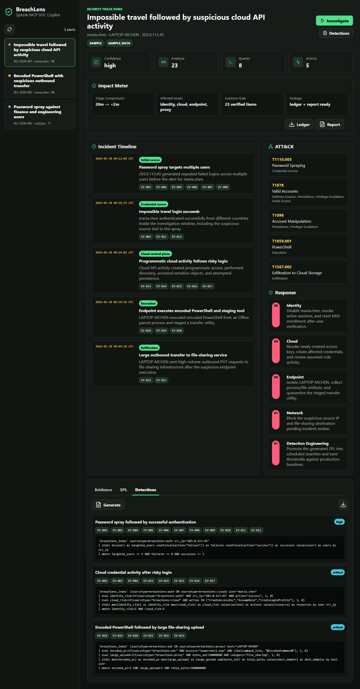
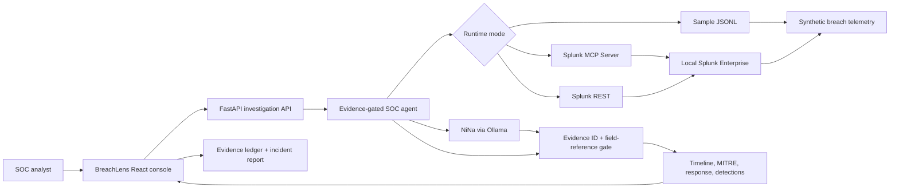

# BreachLens

I built BreachLens for the Splunk Agentic Ops Hackathon Security track. The idea is simple: I do not want an AI chatbot guessing its way through incident response. I want a SOC workflow where every claim has a Splunk-backed evidence ID behind it.

BreachLens takes a suspicious alert, pivots through Splunk data, builds an incident timeline, maps the activity to MITRE ATT&CK, suggests response actions, and exports both an evidence ledger and a Markdown incident report. The AI piece is useful, but it is deliberately boxed in: it can summarize the evidence, and the backend only accepts notes that cite real evidence IDs and concrete fields.



## What I Built

- A Splunk app with a `breachlens` index, JSON sourcetypes, sample breach telemetry, saved searches, macros, and a dashboard.
- A FastAPI backend with three data modes:
  - `rest`: local Splunk Enterprise live-data mode.
  - `mcp`: Splunk MCP Server mode for the final hackathon proof.
  - `sample`: offline development mode.
- A React/Vite SOC console with an alert queue, proof strip, timeline, evidence drawer, SPL transcript, MITRE mapping, response plan, exports, and detection drafts.
- An evidence-gated analyst note that can use NiNa through Ollama.
- Tests for the backend investigation flow and the frontend demo path.

## Why I Think It Matters

Most SOC copilots demos look nice until you ask, "Where did that claim come from?" BreachLens is built around that question.

The workflow is intentionally evidence-first:

1. Splunk returns the alert and related telemetry.
2. The agent records the tool calls and SPL pivots it used.
3. Evidence items get stable IDs like `EV-001`.
4. Timeline events, MITRE mappings, response actions, reports, and AI notes cite those IDs.
5. If an AI response does not cite real evidence IDs and concrete evidence fields, the backend falls back instead of trusting it.

That is the whole point: useful AI, but with guardrails an analyst can audit.

## Hackathon Fit

- **Track:** Security
- **Bonus target:** Best Use of Splunk MCP Server
- **Demo video:** [BreachLens - Splunk MCP SOC Copilot with Evidence-Gated AI](https://youtu.be/FM6DZyjPXbs)
- **AI model used in my demo:** NiNa through local Ollama, with the model link shown in the UI: [LockeLamora2077/NiNa](https://huggingface.co/LockeLamora2077/NiNa)
- **What judges should look for:** the first-viewport proof strip, SPL transcript, evidence drawer, Splunk source links, ledger/report exports, and generated detections.

For the Devpost write-up I am using, see [docs/devpost_submission.md](docs/devpost_submission.md).
For my current live-environment status, see [docs/live_validation.md](docs/live_validation.md).

## Live Proof Modes

I am keeping the modes explicit because this is security tooling and pretending sample data is live data is how demos get weird.

| Mode | Client label | What it means |
| --- | --- | --- |
| `rest` | `splunk_rest` | Uses the local Splunk Enterprise container and real indexed `breachlens` data. This is the normal local validation path. |
| `mcp` | `splunk_mcp` | Uses Splunk MCP Server. This is the final hackathon/bonus-prize proof mode. |
| `sample` | `sample_data` | Uses local JSONL files only. Good for development, not for the final recording. |

In the demo recording, the proof strip should show:

```text
Splunk MCP live
mcp
splunk_mcp
NiNa
4/4 observed
```

The four MCP calls that should be visible are:

```text
splunk_get_indexes
splunk_get_metadata
splunk_get_knowledge_objects
splunk_run_query
```

Tool names alone are not enough for MCP proof. The SPL transcript also records `transport`, and the UI only counts those four calls as MCP proof when the backend is actually running `mcp / splunk_mcp`.

One small naming note: BreachLens displays those four logical labels because they are the proof points I want visible in the demo. The MCP client maps them to the installed Splunk MCP Server tool names when the local server exposes newer names, such as `get_indexes` and `run_query`.

## How Splunk And AI Fit Together

1. `apps/breachlens_splunk/` defines the Splunk app, index, sourcetypes, inputs, saved searches, macros, and dashboard.
2. Splunk indexes synthetic auth, cloud, endpoint, proxy, and alert events from `sample_data/`.
3. The backend runs the investigation through REST or MCP, depending on `BREACHLENS_MODE`.
4. In MCP mode, the agent uses Splunk MCP Server tools for index discovery, metadata, knowledge objects, and SPL searches.
5. NiNa/Ollama can generate the analyst note, but the backend only accepts structured JSON with supported statuses, valid evidence IDs, and claim-level field references such as `EV-001.user`.
6. The UI shows the result as a SOC workflow, not a chat transcript.



## Repository Layout

```text
apps/breachlens_splunk/   Splunk app with index, sourcetypes, saved searches, dashboard
backend/                  FastAPI API, Splunk MCP/REST clients, agent, tests
frontend/                 React/Vite SOC console and Playwright smoke test
sample_data/              Synthetic multi-stage breach JSONL logs
docs/                     Devpost notes, demo script, checklist
architecture_diagram.md   Root-level architecture diagram for Devpost
```

## Quick Start

1. Copy the environment template.

   ```powershell
   Copy-Item .env.example .env
   ```

   Set a local `SPLUNK_PASSWORD` in `.env` before starting Splunk. The template defaults to `BREACHLENS_MODE=rest`, so the app uses live data from the local Splunk container.

2. Start local Splunk Enterprise.

   ```powershell
   docker compose up -d splunk
   ```

3. Open Splunk at `http://127.0.0.1:18000` and log in as `admin` with the password from `.env`.

4. Create the backend environment and install dependencies.

   ```powershell
   cd backend
   python -m venv .venv
   .\.venv\Scripts\python.exe -m pip install --upgrade pip
   .\.venv\Scripts\python.exe -m pip install -r requirements.txt
   ```

5. Verify Splunk has indexed the demo data.

   ```powershell
   @'
   from app.config import load_settings
   from app.splunk_client import make_splunk_client

   client = make_splunk_client(load_settings())
   print(client.name)
   print(client.run_query("search index=breachlens | stats count by sourcetype", earliest="0"))
   '@ | .\.venv\Scripts\python.exe -
   ```

   Expected client in normal live-data mode:

   ```text
   splunk_rest
   ```

6. Run the backend.

   ```powershell
   .\.venv\Scripts\python.exe -m uvicorn app.main:app --reload --host 127.0.0.1 --port 8080
   ```

7. Run the frontend.

   ```powershell
   cd ..\frontend
   npm install --ignore-scripts
   npm run dev
   ```

8. Open `http://localhost:5173`.

## MCP Demo Setup

The local REST path proves the app is using live Splunk data. For the Splunk MCP bonus proof, install Splunk MCP Server in the local Splunk instance, enable the needed tool execution capability for the demo role, generate an encrypted MCP token, and set:

```text
BREACHLENS_MODE=mcp
SPLUNK_MCP_URL=<endpoint from the Splunk MCP Server app>
SPLUNK_MCP_TOKEN=<encrypted token from the Splunk MCP Server app>
SPLUNK_MCP_VERIFY_TLS=false
```

Then restart the backend.

I keep the detailed live setup steps in [docs/mcp_live_setup.md](docs/mcp_live_setup.md).

## NiNa / Ollama

For my demo, I use NiNa through Ollama:

```text
OLLAMA_BASE_URL=http://127.0.0.1:11434
OLLAMA_MODEL=hf.co/LockeLamora2077/NiNa:latest
```

If no model is configured, BreachLens uses deterministic fallback reasoning and labels that clearly in the UI.

## MCP Demo Validation

After Splunk, the Splunk MCP Server app, the backend, and the frontend are running in MCP mode:

```powershell
.\backend\.venv\Scripts\python.exe backend\scripts\validate_mcp.py --out docs\mcp_validation.md
```

```powershell
cd frontend
$env:EXPECTED_BREACHLENS_MODE = "mcp"
$env:EXPECTED_SPLUNK_CLIENT = "splunk_mcp"
$env:EXPECTED_AI_MODEL_LABEL = "NiNa"
npm run test:live
```

This captures `docs/breachlens-ui-real-splunk.png`, downloads the evidence ledger and incident report, and checks that the proof strip and SPL transcript show the MCP signals I need for the recording.

## AI Evaluation

I added a small evaluator so the AI behavior is reproducible instead of being judged from one screenshot:

```powershell
cd backend
.\.venv\Scripts\python.exe scripts\evaluate_ai.py --alerts 3
```

The current local run is saved in [docs/ai_evaluation.md](docs/ai_evaluation.md). In that run, NiNa returned accepted JSON for all three alerts, with valid evidence IDs and field-backed claims, while the deterministic path stayed clearly labeled as fallback.

## API

- `GET /api/alerts`
- `POST /api/investigations`
- `GET /api/investigations/{id}`
- `POST /api/detections`
- `GET /api/investigations/{id}/ledger`
- `GET /api/investigations/{id}/report.md`

Example investigation request:

```json
{
  "alert_id": "BLS-2026-001",
  "objective": "Determine account takeover and blast radius"
}
```

## Demo Flow

1. Show the proof strip so the runtime mode, Splunk client, model, tool calls, and evidence count are visible.
2. Run the critical impossible-travel alert investigation.
3. Walk the incident timeline and click evidence IDs.
4. Show raw Splunk fields and source-event links in the evidence drawer.
5. Show the SPL transcript.
6. Export the evidence ledger and incident report.
7. Generate detection drafts.

## Tests

Backend:

```powershell
cd backend
.\.venv\Scripts\python.exe -m unittest discover tests
```

Frontend:

```powershell
cd frontend
npm run test:e2e
```

## Security Notes

- No secrets are committed. `.env` is ignored.
- MCP tokens must be generated locally in the Splunk MCP Server app.
- The AI note is evidence-gated and constrained to known evidence IDs plus concrete evidence field references.
- The backend rejects obvious prompt-injection objectives such as requests to ignore instructions or reveal system prompts.
- The included `rest` setup is for local demo use. It can use basic auth and `SPLUNK_VERIFY_TLS=false` because the Splunk management port is bound to localhost in Docker.
- For production, I would use token auth, TLS verification, a least-privilege Splunk role, locked-down CORS, network allowlists, and secret storage outside `.env`.
- The MCP token, Splunk token, and any model API key should never be committed or shown in the demo recording.
