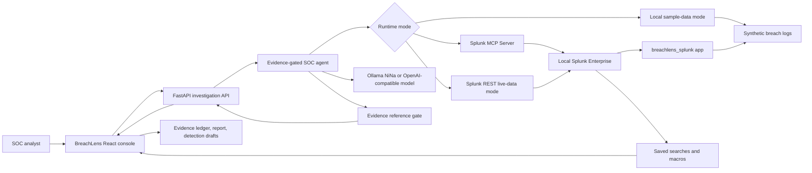

# BreachLens Architecture Diagram

This is the required root-level architecture diagram for the submission. I kept the diagram focused on the real data path: React UI, FastAPI, the evidence-gated agent, Splunk, optional MCP, and the local model.

## Data Flow

1. Splunk indexes synthetic auth, EDR, cloud, proxy, and alert events into the `breachlens` index.
2. I select an alert in the React console and start an investigation.
3. FastAPI sends the request to the SOC agent.
4. The agent gathers Splunk context through either REST or Splunk MCP Server.
5. In MCP mode, the tool calls I want visible are `splunk_get_indexes`, `splunk_get_metadata`, `splunk_get_knowledge_objects`, and `splunk_run_query`.
6. NiNa/Ollama can write the analyst note, but the backend accepts it only when it cites valid evidence IDs.
7. The UI renders the proof strip, timeline, MITRE mapping, evidence drawer, SPL transcript, response actions, exports, and detections.

## Proof Signals

For normal local validation, the UI should show `rest / splunk_rest` and Splunk-backed evidence links.

For the final MCP recording, the UI should show:

- `Splunk MCP live`
- `mcp`
- `splunk_mcp`
- `NiNa`
- `4/4 observed`
- Splunk source-event links on evidence cards
