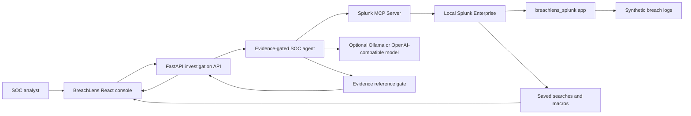

# BreachLens Architecture Diagram

## Data Flow

1. Synthetic authentication, EDR, cloud, proxy, and alert events are indexed into the `breachlens` Splunk index.
2. The analyst selects an alert in the React console and starts an investigation.
3. The FastAPI backend asks the SOC agent to create an investigation plan.
4. The agent uses Splunk MCP tools such as `splunk_run_query`, `splunk_get_indexes`, `splunk_get_metadata`, and `splunk_get_knowledge_objects`.
5. Optional LLM output is accepted only when claims reference evidence IDs returned from Splunk queries.
6. The UI renders the incident timeline, MITRE ATT&CK mapping, evidence, SPL transcript, and detection drafts.

